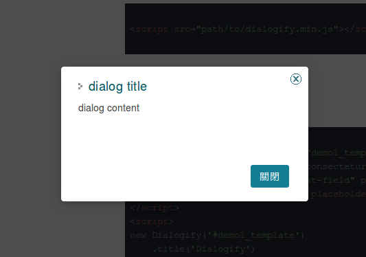

# Dialogify

A javascript plugin for creating dialog, implements with HTMLDialogElement.

## Installation

```bash
npm install @oneup_network/dialogify jquery
```

`jquery` is a **peer dependency** — install it alongside dialogify (or load it
globally before the browser bundle).

### Browser (global build)

```html
<script src="path/to/jquery.min.js"></script>
<script src="path/to/dialogify.min.js"></script>
```

The browser build injects its own CSS, so no extra stylesheet is required.

### Module (ESM / CommonJS)

```javascript
import Dialogify from '@oneup_network/dialogify';
// optionally link the standalone stylesheet: @oneup_network/dialogify/css
```

## Basic usage

```javascript
new Dialogify('dialog content')
    .title('dialog title')
    .buttons([{ type: Dialogify.BUTTON_PRIMARY }])
    .showModal();

// alternate alert, confirm and prompt
(async function () {
    await Dialogify.alert('Alert!!');

    if (await Dialogify.confirm('Yes or no？')) {
        // blah..
    }

    const answer = await Dialogify.prompt('Question？');
    // if (answer == blah...)
})();
```



## Working with an open dialog

### Awaiting the result

`show()` and `showModal()` resolve with the dialog's `returnValue` once it closes:

```javascript
const dialog = new Dialogify('Are you sure?').buttons([
    { text: 'Yes', type: Dialogify.BUTTON_PRIMARY, click: () => dialog.close('yes') },
    { text: 'No', click: () => dialog.close('no') }
]);

const answer = await dialog.showModal(); // 'yes' or 'no'
```

### Preventing a close

`beforeclose` fires before every close — buttons, the close button, `ESC`, the
backdrop, a `<form method="dialog">` submit and `close()` itself. Cancel it to
keep the dialog open:

```javascript
dialog.on('beforeclose', async (event) => {
    if (isDirty) {
        event.preventDefault();
        if (await Dialogify.confirm('Discard your changes?')) {
            isDirty = false;
            dialog.close();
        }
    }
});
```

### Updating content

```javascript
dialog.setContent('<p>Step 2</p>'); // replaces the body, keeps title and buttons
dialog.getContent();

await dialog.load('/ajax/step2', { id: 7 }); // fetch into the body, with a loading state
```

### Loading state

```javascript
dialog.setLoading(true); // overlay across the dialog content
dialog.setLoading(false);
dialog.isLoading();

dialog.updateButton('save', { loading: true }); // busy spinner, disabled, swaps in loadingText
```

### Forms

The content is wrapped in `<form method="dialog">` by default, so native
validation and `FormData` work out of the box:

```javascript
const dialog = new Dialogify('<input name="title" required>').buttons([
    {
        id: 'save',
        text: 'Save',
        type: Dialogify.BUTTON_PRIMARY,
        loadingText: 'Saving...',
        click: async () => {
            if (!dialog.validate()) {
                return; // reports the first invalid field
            }

            dialog.updateButton('save', { loading: true });
            await save(dialog.formValues()); // { title: '...' }
            dialog.close('saved');
        }
    }
]);
```

`formValues()` returns a plain object (repeated fields become arrays);
`formData()` returns a `FormData`, or `null` when `useDialogForm` is `false`.

### Managing buttons

```javascript
dialog.addButton({ id: 'more', text: 'More' });
dialog.addButton({ id: 'first', text: 'First' }, { prepend: true });
dialog.updateButton('more', { text: 'Fewer', type: Dialogify.BUTTON_DANGER, disabled: true });
dialog.removeButton('more');
dialog.getButton('save'); // the button's jQuery object
```

## Drawers, toasts and popovers

### Drawer

`position` slides the dialog in from an edge instead of centring it:

```javascript
new Dialogify('<h4>Filters</h4>', { position: Dialogify.POSITION_RIGHT }).showModal();
```

```html
<dialog is="bahamut-dialogify" position="right">Filters</dialog>
```

Accepts `left`, `right`, `top` and `bottom`.

### Toast

A lightweight, auto-dismissing notification. Toasts stack in a fixed corner
container and are not modal, so they never block the page:

```javascript
Dialogify.toast('Saved');
Dialogify.toast('Could not save', {
    type: Dialogify.TOAST_ERROR, // TOAST_INFO (default), TOAST_SUCCESS, TOAST_WARNING
    position: 'bottom-right', // or Dialogify.TOAST_BOTTOM_RIGHT; default top-right
    duration: 5000, // 0 keeps it open until closed
    title: 'Error',
    closable: true
});
```

Hovering a toast pauses its auto-dismiss timer. `Dialogify.toast()` returns the
dialog instance, so `close()` and the usual events are available.

### Anchored popover

`showAt()` positions a non-modal dialog next to another element, for dropdowns
and popover cards. It flips to the opposite side when the preferred placement
would overflow the viewport, and follows the anchor on scroll and resize:

```javascript
new Dialogify('<ul>...</ul>', { closable: false, useDialogForm: false }).showAt('#menu-button', {
    placement: 'bottom', // top | bottom | left | right
    align: 'start', // start | center | end
    offset: 8,
    toggle: true // clicking the anchor again closes it, default true
});
```

```html
<dialog is="bahamut-dialogify" anchor="#menu-button" placement="bottom" align="end">…</dialog>
```

```javascript
document.querySelector('dialog[is="bahamut-dialogify"]').showAt();
```

A popover is dismissed by a click anywhere outside it. Clicking the anchor that
opened it toggles it shut: that click is swallowed, so the handler that called
`showAt()` does not run and immediately reopen it. Clicking a _different_
trigger is left alone, so it closes this popover and opens its own. Pass
`toggle: false` to let the anchor click through, or `closable: false` to keep
the popover open until you close it yourself.

### Animation

Drawers slide in and out from their edge, toasts fade and scale, and popovers
fade in place. The exit animation runs after the dialog has closed, so a dialog
with `autoRemove` stays in the DOM until it finishes. A closing toast collapses
its own height at the same time, so the toasts stacked below it slide up instead
of jumping when it is removed. All of them are disabled under
`prefers-reduced-motion: reduce`.

## Accessibility

- `title()` links the heading to the dialog with `aria-labelledby`.
- The close button is exposed as a button, is keyboard focusable and activates
  with <kbd>Enter</kbd> / <kbd>Space</kbd>, and is labelled from the locale.
- Decorative icons are hidden from assistive technology; the loading indicator
  and toasts announce themselves with `role="status"`.
- Buttons in their loading state are marked `aria-busy`.
- Animations are disabled under `prefers-reduced-motion`.

Modal dialogs get focus trapping and focus restoration from the native
`<dialog>` element itself.

## Dialog content is HTML

The `source` passed to `new Dialogify(source)` and the `message` passed to
`Dialogify.alert` / `confirm` / `prompt` are inserted as **HTML** — this is an
intentional feature so you can render rich content:

```javascript
new Dialogify('<p>Rich <strong>HTML</strong> content</p>').showModal();
```

`source` is resolved as follows:

- a string starting with `#` is treated as a selector and its inner HTML is cloned;
- a string starting with the ajax prefix (default `/ajax/`) is fetched and injected;
- any other string is inserted as raw HTML.

> ⚠️ **Security:** because content is rendered as HTML, always escape/sanitize any
> untrusted or user-supplied input before passing it to Dialogify to avoid XSS.

## Declarative usage (`<dialog is="bahamut-dialogify">`)

Besides the programmatic API, a dialog can be written directly in HTML using a
[customized built-in element](https://developer.mozilla.org/docs/Web/API/Web_components/Using_custom_elements#customized_built-in_elements).
The element is registered automatically when dialogify is loaded:

```html
<dialog is="bahamut-dialogify" dialog-title="Hello">
    dialog content <b>bold text</b>
    <button ok></button>
    <button cancel></button>
</dialog>
```

```javascript
const dialog = document.querySelector('dialog[is="bahamut-dialogify"]');
dialog.showModal();
```

The element name is prefixed because the custom elements spec requires a hyphen
in the name — `is="dialogify"` is not a valid custom element name.

Unlike `new Dialogify()`, a declarative dialog is **not** removed from the DOM when
it closes, so it can be shown again.

### Methods

`document.querySelector(...)` returns the element itself, and the dialogify API is
available on it:

| Method                       | Description                                       |
| ---------------------------- | ------------------------------------------------- |
| `show()`                     | Show the dialog (non-modal); resolves on close    |
| `showModal()`                | Show the dialog as a modal; resolves on close     |
| `showAt(anchor?, options?)`  | Show anchored to another element                  |
| `reposition()`               | Recompute the anchored position                   |
| `close(returnValue?)`        | Close the dialog (fires `beforeclose`)            |
| `isOpen()`                   | Whether the dialog is open                        |
| `setTitle(text)`             | Set the dialog title                              |
| `setContent(html)`           | Replace the body, keeping title and buttons       |
| `getContent()`               | The current body HTML                             |
| `load(url, data?)`           | Load body content over ajax, with a loading state |
| `setLoading(bool)`           | Toggle the loading overlay                        |
| `isLoading()`                | Whether the loading overlay is shown              |
| `validate()`                 | Run native form validation                        |
| `formData()`                 | The dialog form as `FormData`                     |
| `formValues()`               | The dialog form as a plain object                 |
| `buttons(buttons, options?)` | Set the buttons programmatically                  |
| `addButton(button, opts?)`   | Append (or prepend) one button                    |
| `updateButton(id, changes)`  | Update a button in place                          |
| `removeButton(id)`           | Remove a button                                   |
| `getButton(id)`              | A button's jQuery object                          |
| `on/off(event, handler)`     | Bind/unbind a dialogify instance event            |
| `.dialogify`                 | The backing `Dialogify` instance                  |

> `setTitle()` is used instead of `title()` because `HTMLElement.title` is the
> native tooltip property and must keep its standard behaviour.

### Options as attributes

| Attribute           | Option             | Notes                                                         |
| ------------------- | ------------------ | ------------------------------------------------------------- |
| `dialog-title`      | —                  | Dialog title (`title` is the native tooltip)                  |
| `size="large"`      | `size`             | Maps to `Dialogify.SIZE_LARGE`; any other value is used as-is |
| `position`          | `position`         | Drawer edge: `left` / `right` / `top` / `bottom`              |
| `closable`          | `closable`         | Show the close button                                         |
| `fixed`             | `fixed`            | Use `position: fixed`                                         |
| `background-scroll` | `backgroundScroll` | Allow scrolling behind the dialog                             |
| `use-dialog-form`   | `useDialogForm`    | Wrap content in `<form method="dialog">`                      |
| `src`               | —                  | Load content from this URL instead of the inline markup       |
| `ajax-prefix`       | `ajaxPrefix`       | Ajax prefix used to resolve `src`                             |
| `options='{...}'`   | —                  | Any option as a JSON object                                   |
| `buttons-position`  | —                  | `left` / `center` / `right` (default `right`)                 |
| `anchor`            | —                  | Selector for the anchor element used by `showAt()`            |
| `placement`         | —                  | `top` / `bottom` / `left` / `right` for `showAt()`            |
| `align`             | —                  | `start` / `center` / `end` for `showAt()`                     |
| `offset`            | —                  | Gap in pixels for `showAt()`                                  |

> ⚠️ Because attributes are strings, these booleans are **value-based**, not
> presence-based: use `closable="false"` to disable. A bare attribute, `"true"`,
> or any other value means `true`. This differs from standard HTML boolean
> attributes.

Options that cannot be expressed as attributes (callbacks, style objects) can be
assigned before the dialog is first shown:

```javascript
dialog.options = {
    ajaxComplete() {
        /* ... */
    }
};
```

### Buttons

Add a `<button>` with one of the marker attributes inside the dialog content.
They are collected into a button box that matches the programmatic `buttons()` output:

| Attribute | Style   | Closes the dialog        |
| --------- | ------- | ------------------------ |
| `ok`      | primary | ✅                       |
| `cancel`  | default | ✅ (also fires `cancel`) |
| `close`   | default | ✅                       |
| `primary` | primary | ❌                       |
| `danger`  | danger  | ❌                       |

If the button has no text, a localized default (`Ok` / `Cancel` / `Close`) is used:

```html
<dialog is="bahamut-dialogify">
    Delete this item?
    <button cancel></button>
    <button danger onclick="doDelete()">Delete</button>
</dialog>
```

> Write `<button ok></button>`, not `<button ok />`. Self-closing syntax is not
> valid for HTML elements and makes the parser nest the following siblings.

Declarative buttons join the button list too, so they can be driven from
JavaScript. Give them an `id` to address them by name (otherwise they are keyed
by index), and a `loading-text` for their busy state:

```html
<dialog is="bahamut-dialogify">
    <input name="title" required />
    <button ok id="save" loading-text="Saving...">Save</button>
</dialog>
```

```javascript
dialog.updateButton('save', { loading: true });
```

### Events

`close` and `cancel` are native `<dialog>` events; `show` and `beforeclose` are
dispatched by dialogify. They can all be bound in the usual ways:

```javascript
dialog.addEventListener('show', () => {});
dialog.onshow = () => {};
dialog.onclose = () => {};

dialog.addEventListener('beforeclose', (e) => e.preventDefault()); // keeps it open
dialog.onbeforeclose = () => false; // same thing
```

They can also be bound in markup. `onclose` and `oncancel` are native inline
handlers and behave exactly as the browser defines. In addition, dialogify
resolves a **function name** on `onshow`, `onclose`, `oncancel` and
`onbeforeclose`:

```html
<dialog is="bahamut-dialogify" onshow="myHandler" onclose="MyApp.onClose"></dialog>
```

The name is looked up in `Dialogify.handlers` first, then on `window` (dotted
paths are supported), and it is resolved when the event fires — so handlers may be
defined after the markup. Values that are not plain identifiers are ignored by
dialogify and left to the browser's native inline handler support, so no code is
ever evaluated by dialogify itself.

```javascript
Dialogify.handlers.myHandler = function () {
    // `this` is the dialog element
};
```

### Browser support

Customized built-in elements are not supported in Safari/WebKit, so
`<dialog is="bahamut-dialogify">` is never upgraded there. An optional bundle of
[`@ungap/custom-elements`](https://github.com/ungap/custom-elements) ships with
dialogify; load it **before** dialogify to enable the declarative syntax:

```html
<script src="path/to/custom-elements.min.js"></script>
<script src="path/to/dialogify.min.js"></script>
```

```javascript
import '@oneup_network/dialogify/custom-elements';
import Dialogify from '@oneup_network/dialogify';
```

It is a no-op in browsers that already support the feature, and the programmatic
API works everywhere without it.

## Optional legacy polyfill

Modern browsers support `<dialog>` natively, so no polyfill is bundled by default.
To support legacy browsers, load the optional polyfill **before** dialogify; it
exposes `window.dialogPolyfill`, which dialogify detects at runtime:

```html
<script src="path/to/dialog-polyfill.min.js"></script>
<script src="path/to/dialogify.min.js"></script>
```

## Usage and examples

[https://oneupnetwork.github.io/dialogify/](https://oneupnetwork.github.io/dialogify/)

## Dependencies

- [jQuery](https://jquery.com/) (peer dependency, `>=3.0.0`)

## Browser compatibility

All modern browser

## Designed by

[Phoebe](https://github.com/Phoebe1226)

## Contribute

- Fork & clone this repo
    ```
    npm install
    npm run build
    ```
- Create branch and commit your changes
- Open a pull request

Feel free to contribute

## License

MIT
